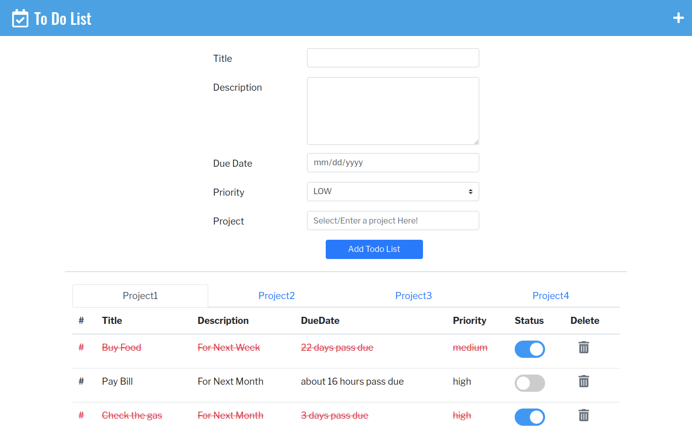

# Odin Todo List App

> An Odin Project to learn JavaScript key concepts by utilizing only plain JavaScript (without any JS framework).

In this todo app, we tried to demonstrate some advance programming concepts, such as:

* OOP Principles (Object Oriented Programming).
  * Single Responsibility.
  * Loose Coupling (Try to implement Later).

* Objects.
* Factory Functions.
* Module Pattern.
* Module-View-Controller(MVC) architectural pattern.

We also tried to utilize various modern technologies to help imitating real world development experiences from this project, you are welcome to replicate, distribute and re-generate our project for your personal learning purpose.




## Built With

* JavaScript (ES6)
* HTML5/CSS
* Webpack
* Eslint
* Bootstrap/Fontawesome


## ✨ Live Demo
[Project Online Demo](https://kelvin8773.github.io/odin-todo-list/).

## How to Run Locally

Clone the project to your local machine and following following steps.

> To Clone Project Locally.
```bash
git clone git@github.com:kelvin8773/odin-todo-list.git
cd odin-to-do-list
```
> To install dependencies
```bash
npm install
```
> To build the project
```bash
npm build
```
> To Run Locally
```bash
npm start 
```
> Open http://127.0.0.1:8080 using your favourite broswer, if it doesn't open automatically.

## How to get into Development mode

Once you can run the project locally, you can choose either **build once** or **continue build** to reflect changes from development.

> To build once
```bash
npm run dev
```
> To continue build
```bash
npm run watch
```

> Once you are ready to deploy the project into production environment, you can run `npm build` to produce the production ready files (under `./dist` folder).


## Authors

- [Abdusaid Abdurasulov](https://github.com/Abdusaid10)
- [Kelvin Liang](https://github.com/kelvin8773)

## 🤝 Contributing
Contributions, issues and feature requests are welcome!

Feel free to check the [issues page](https://github.com/kelvin8773/odin-todo-list/issues).

## Show your support

Give a ⭐️ if you like this project!


## 📝 License
This project is [MIT](./LICENSE) licensed.


